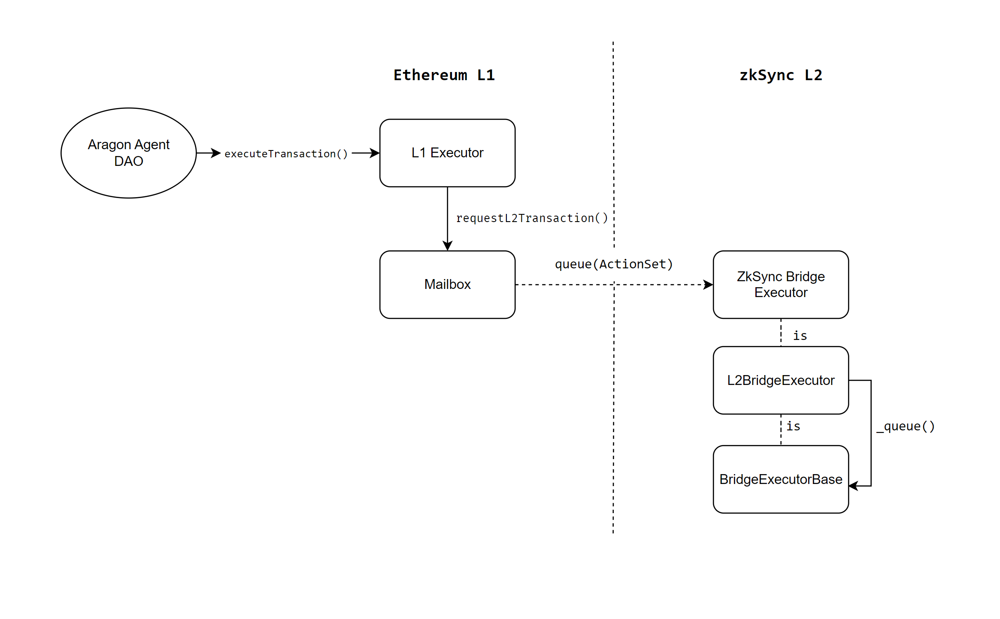
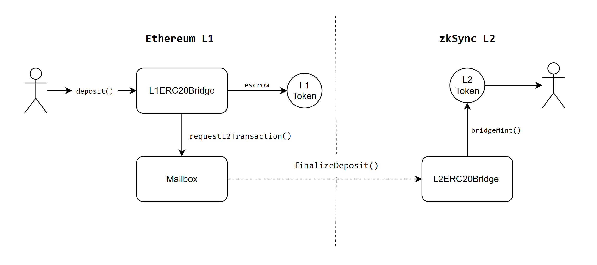
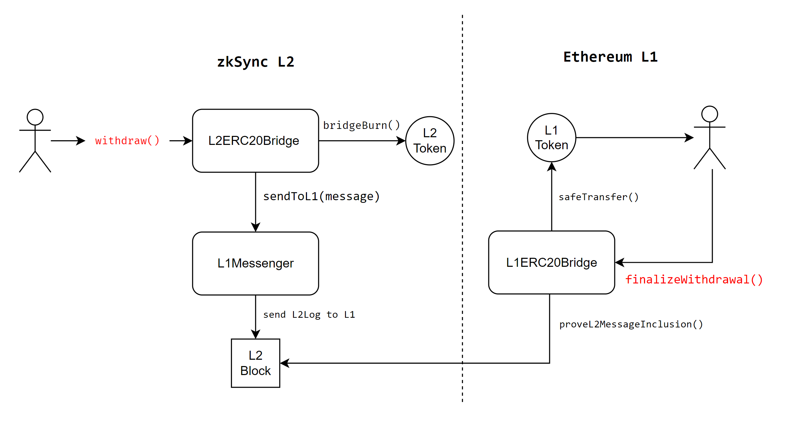

# Lido's zkSync Era Bridge

The document details the implementation of the bridging of the wstETH (wrapped staked ETH) between Ethereum and zkSync Era chains.

It's the first step of Lido's integration into the zkSync protocol. The main goal of the current implementation is to be the strong foundation for the long-term goals of the Lido expansion in the zkSync Era chain. The long-run picture of the Lido's integration into L2s includes:

- Bridging of Lido's tokens from L1 to L2 chains
- Instant ETH staking on L2 chains with receiving stETH/wstETH on the corresponding L2 immediately
- Keeping UX on L2 as close as possible to the UX on Ethereum mainnet

At this point, the implementation must provide a scalable and reliable solution for Lido to bridge ERC20 compatible tokens between zkSync Era and the Ethereum chains.

## zkSync's Bridging Implementation

The default implementation of the zkSync bridging solution consists of two parts: `L1ERC20Bridge` and `L2ERC20Bridge`. These contracts allow bridging the ERC20 tokens between Ethereum and zkSync Era chains.

In the standard bridge, when ERC20 is deposited on L1 and transferred to the bridge contract it remains "locked" there while the equivalent amount is minted in the L2 token. For withdrawals, the opposite happens the L2 token amount is burned then the same amount of L1 tokens is transferred to the recipient.

The default zkSync bridge is suitable for the short-term goal of the Lido (bridging of the wstETH token into zkSync Era), but it complicates the achievement of the long-term goals. For example, implementation of the staking from L2's very likely will require extending the token and bridge implementations.

Additionally, zkSync provides functionality to implement the custom bridge solution utilizing the same cross-domain infrastructure as the Standard bridge. The only constraint for the custom bridge to be compatible with the default zkSync bridge is the implementation of the `IL1ERC20Bridge` and `IL2ERC20Bridge` interfaces.

## Cross-chain Governance Bridge

The goal of cross-chain governance is bridging the Lido DAO governance decisions, voted by the LDO holders on Ethereum, to zkSync Era network. This bridge represents the upgradeable version of [AAVE cross-chain governance bridge](https://github.com/aave/governance-crosschain-bridges), adjusted to operate on the zkSync Era network. The main component of this bridge is `ZkSyncBridgeExecutor` contract on L2, which queues the action sets sent from L1 Lido Agent through `L1Executor`.



## zkSync's Bridging Flow

The general process of bridging tokens via zkSync's Lido bridge consists of next steps:

### Deposits

- User calls `L1ERC20Bridge.deposit()` (with wstETH L1 token address as an argument).
- `L1ERC20Bridge` escrows appropriate amount of L1 tokens.
- `L1ERC20Bridge` calls `Mailbox.requestL2Transaction()` which initiates the transaction on zkSync network.
- After the transaction is picked from the priority queue by validators, it triggers `L2ERC20Bridge.finalizeDeposit()` on zkSync network.
- `L2ERC20Bridge` mints the appropriate amount of L2 wstETH tokens for the l2 receipient.



### Withdrawals

- User calls `L2ERC20Bridge.withdraw()` on zkSync which burns the appropriate amount of L2 wstETH tokens.
- `L2ERC20Bridge` calls `L1Messenger.sendToL1()` method with a message passed as a raw bytes array.
- This message is then included in L2 block.
- `L1ERC20Bridge.finalizeWithdrawal()` needs to be triggered as the separate transaction on L1, which should prove the L2 message inclusion in L2 block in order to "unlock" the appropriate amount of L1 tokens from the `L1ERC20Bridge` and transfer them to the L1 receipient.



# Deployment

To compile Lido zkSync contracts, run the `compile.sh` script:

```
> ./compile.sh
```

To deploy Lido zkSync contracts, run the `deploy.sh` script:

```
> ./deploy.sh
```

## Tests

### Unit Tests

There is the same script that can be run in both `l1` and `l2` folders:
```
> npm run zksync:test:unit
```

### E2E Tests

Run the following command in the `l1` folder:
```
> npm run zksync:test:e2e
```

### Deposit/Withdrawal Tests
Run the following commands in the `l1` folder after deploying the bridge:
```
> npm run test-deposit
```
```
> npm run test-withdraw
```

### Deployment Acceptance Tests

Run the following command in the `l1` folder:
```
> npm run deployment-acceptance
```


# Statements

| Statement | Answer |
|--------------------------------|-------------------|
| It is possible to bridge wstETH forth and back using this bridge |Yes.|
| The bridge using a canonical mechanism for message/value passing |Yes, canonical zkSync mechanism for calling L2 functions from L1 + canonical mechanism to confirm txs from L2 on L1.|
| The bridge is upgradeable |Yes, all parts of the wstETH bridge on L1 and L2 are deployed behind an `OssifiableProxy`. Additionally, `TransparentUpgradableProxy` is used for deploying governance bridge components and wstETH token on L2.|
| Upgrade authority for the bridge |Only Aragon Agent on L1 (Lido DAO) has the permissions to change the implementation of the bridges (upgrade) and enable (disable) deposits (withdrawals) on L1 and L2 bridges (using cross-chain governance bridge). Additionally, a multisig of guardians can be added which can cancel any upgrade or parameter setting call on L2 but cannot initiate them.|
| Emergency pause/cancel mechanisms and their authorities |There's deposit/withdrawal disabler roles on L1 and L2 part of the bridge that will be granted to Emergancy Brakes multi-sigs on both networks.|
| The bridged token support permits and ERC-1271 |Yes, L2 token is extended to support ERC20Permit which allows for signed approvals (permits). ERC-1271 standards is supported as well, to allow Smart Contract Accounts (Account Abstraction) to interact with the token.|
| Are the following things in the scope of this bridge deployment: | |
| Passing the (w)stETH/USD price feed | No. |
| Passing Lido DAO governance decisions | Yes, for upgrading the L2 part of bridge and enabling/disabling deposit/withdrawal.|
| Bridges are complicated in that the transaction can succeed on one side and fail on the other. What's the handling mechanism for this issue? | For deposits there is a way to claim failed deposits in case that tx passes on L1 but fails on L2. For withdrawals, if the tx passes on L2 and fails on L1, the funds will be burnt on L2 and locked on L1 bridge until someone passes the correct L2-L1 message inclusion proof to unlock the funds to L1 receiver.|
| Is there a deployment script that sets all the parameters and authorities correctly? | There is a `deploy.sh` script that takes the addresses from environment variables. | 
| Is there a post-deploy check script that, given a deployment, checks that all parameters and authorities are set correctly? | Yes. Check `l1/test/deployment.acceptance.test.ts` |
